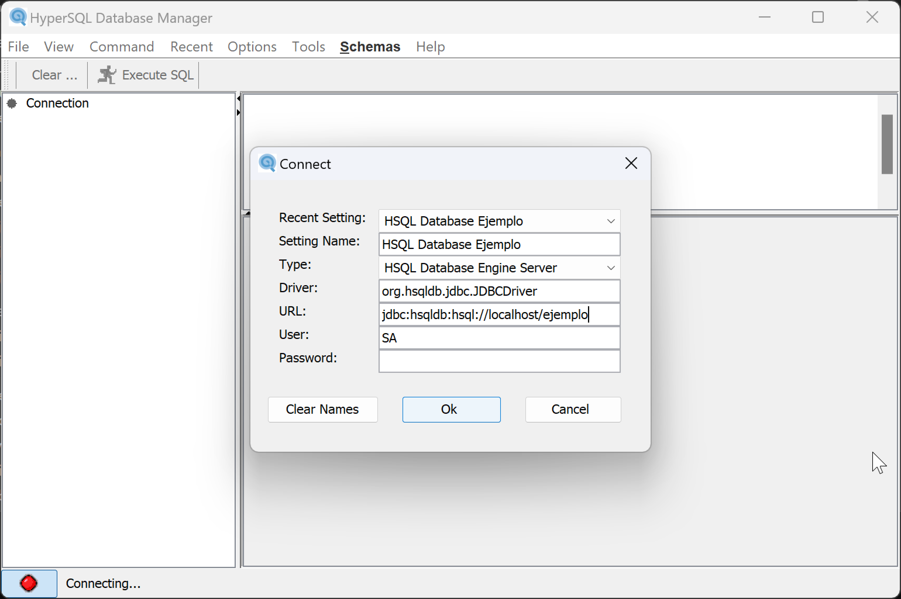

= Iniciar HyperSQL en modo servidor
:text-align: justify

HSQLDB se puede iniciar en modo servidor, de manera que use su propio proceso, independiente de nuestra aplicación cliente.

Supongamos que hemos definido una variable de entorno HSQLDB_HOME al directorio donde hemos instalado los archivos de HSQLDB. En este directorio existen, entre otras, una carpeta lib (donde se encuentran los jar modulares) y una carpeta data (donde haremos que se ubiquen los archivos de las bases de datos que creemos)

Para lanzar una instancia de HSQLDB en modo servidor hacemos uso del jar hsqldb.jar de la carpeta lib y la clase que contiene el método main para arrancar la aplicación se llama Server y se encuentra en el paquete org.hsqldb.server. Por lo tanto, el comando para lanzar la aplicación y ver la ayuda será:
[,console]
----
java -p %HSQLDB_HOME%/lib/hsqldb.jar -m org.hsqldb/org.hsqldb.server.Server --help
----
Con lo que deberemos ver por consola lo siguiente:
[,console]
----
+-----------------+-------------+----------+------------------------------+
|     OPTION      |    TYPE     | DEFAULT  |         DESCRIPTION          |
+-----------------+-------------+----------+------------------------------|
| --help          | -           | -        | displays this message        |
| --address       | name|number | any      | server inet address          |
| --port          | number      | 9001/544 | port at which server listens |
| --database.i    | [type]spec  | 0=test   | name of database i           |
| --dbname.i      | alias       | -        | url alias for database i     |
| --silent        | true|false  | true     | false => display all queries |
| --trace         | true|false  | false    | display JDBC trace messages  |
| --tls           | true|false  | false    | TLS/SSL (secure) sockets     |
| --no_system_exit| true|false  | false    | do not issue System.exit()   |
| --remote_open   | true|false  | false    | can open databases remotely  |
| --props         | filepath    |          | file path of properties file |
+-----------------+-------------+----------+------------------------------+

The server looks for a 'server.properties' file in the current directory and
loads properties from it if it exists.
Command line options override those loaded from the 'server.properties' file.

See the HSQLDB User Guide for further details.
----
La opción `database.i` se usa para indicar el archivo que almacenará la base de datos número *i*. Normalmente la primera base de datos que queremos que sirva el servidor será la número 0.

La opción `dbname.i` sirve para poner un alias mediante el cual identificar a la base de datos en la url de conexión.

Por ejemplo, para lanzar el servidor y que sirva una base de datos cuyo fichero ubicamos en el directorio `HSQLDB_HOME/data` con nombre `ejemplodb` y con alias `ejemplo`, nos ubicamos en el directorio y desde ahi lanzamos el comando:

[,console]
----
java -p ../lib/hsqldb.jar -m org.hsqldb/org.hsqldb.server.Server --database.0 file:ejemplo --dbname.0 ejemplo
----

Con ello tendremos lanzado un servidor HSQLDB escuchando conexiones en el puerto 9901 TCP y sirviendo datos de la base de datos ejemplo.

La url de conexión que necesitará un cliente para conectar es la siguiente:
[,console]
----
jdbc:hsqldb:hsql://localhost/ejemplo
----

Para no tener que indicar los argumentos en la línea de comandos cuando iniciamos el servidor, podemos crear y configurar un archivo de propiedades.

Cuando el servidor arranca busca un archivo con nombre server.properties en el directorio desde el que lo lanzamos. Si existe, lo lee y establece su configuración.

Por tanto, si creamos el archivo server.properties en la carpeta `HSQLDB_HOME\data` podemos configurar desde el archivo el servidor para que use la base de datos `ejemplodb` con alias `ejemplo` de la siguiente manera:

server.properties
[#server.properties,shell]
----
server.database.0=file:ejemplodb
server.dbname.0:ejemplo
----

Ahora para lanzar el servidor simplemente ejecutamos:

[,console]
----
java -p ../lib/hsqldb.jar -m org.hsqldb/org.hsqldb.server.Server
----

El propio módulo hsqldb.jar contiene una aplicación GUI Swing que podemos usar como cliente para conectar al servidor. Para abrirla simplemente hacemos doble clic sobre el archivo.

En el cuadro de diálogo de conexión en la opción *type* seleccionamos `Server` y en la opción *url* escribimos la url de conexión antes indicada.

Pero también podemos usar la herramienta *sqltool*, la cual podemos ejecutar usando el argumento `inlineRc` y pasando la url

[,console]
----
java -jar %HSQLDB_HOME%/lib/sqltool.jar --inlineRc=url=jdbc:hsqldb:hsql://localhost/ejemplo
----
Además de usar el argumento inlineRc podemos hacer uso de un fichero de configuración `sqltool.rc`, el cual debemos colocar en el directorio `HOME` del usuario.

El contenido del fichero sería:
[,shell]
----
urlid ejemplo
url jdbc:hsqldb:hsql://localhost/ejemplo
username SA
password
----

Con lo que ahora para lanzar sqltool para conectar con la base de datos ejemplo usamos el `urlid` como argumento.

[,console]
----
java -jar %HSQLDB_HOME%/lib/sqltool.jar ejemplo
----